# 🪪 Synthetic Employee Dataset: SQL, PySpark & ML Pipeline

#### This repository aims to:

- **Generate** a synthetic dataset with one million records simulating employee information from a fictional company.

- **Load** the generated data into a PostgreSQL database using integration tools.

- **Develop** analytical reports using PySpark, applying large-scale data analysis techniques.

- **Implement** predictive models with machine learning to project trends in hiring and layoffs on a monthly and yearly basis.

# 📝 requirements.txt file

1. Create a file named **requirements.txt** with the following content:

```
pandas
numpy
faker
psycopg2-binary
pyspark
scikit-learn
matplotlib
seaborn
```

2. Then, **install** all dependencies by running:

```
pip install -r requirements.txt
```

# 📁 Project Structure

```
sql-mock-data/
├── data/
│   └── *.csv                  # Synthetic employee data files
├── images/
│   └── pic*.png               # Visualizations and example outputs
├── python/
│   ├── sql_mock_data.py       # Script to generate synthetic data
│   ├── insert.py              # Script to insert data into PostgreSQL
│   ├── analysis.py            # Data analysis using PySpark
│   ├── queries.py             # SQL queries for data retrieval
│   ├── show_results.py        # Visualization of query results
│   └── connection.py          # Database connection setup
├── sql/
│   └── schema.sql             # SQL schema definitions
├── .gitignore                 # Specifies files to ignore in Git
└── README.md                  # Project documentation
```

# 🔥 Introduction to PySpark
- **PySpark** it's the Python API for Apache Spark, enabling the use of Spark with Python.

## 🔑 Key Features:

1. **Distributed Computing:** Processes large datasets across a cluster of computers for scalability.

2. **In-Memory Processing:** Speeds up computation by reducing disk I/O.

3. **Lazy Evaluation:** Operations are only executed when an action is triggered, optimizing performance.

4. **Rich Libraries:**
    - **Spark SQL:** Structured data processing (like SQL operations).
    - **MLlib:** Machine learning library for scalable algorithms.
    - **GraphX:** Graph processing (via RDD API).
    - **Spark Streaming:** Real-time stream processing.

5. **Compatibility:** Works with Hadoop, HDFS, Hive, Cassandra, etc.

6. **Resilient Distributed Datasets (RDDs):** Low-level API for distributed data handling.

7. **DataFrames & Datasets:** High-level APIs for structured data with SQL-like operations.

## ✅ Pros — ❌ Cons

| Pros                                                  | Cons                                            |
|-------------------------------------------------------|-------------------------------------------------|
| Handles massive datasets efficiently.                 | Can be memory-intensive.                        |
| Compatible with many tools (Hadoop, Cassandra, etc.). | Complex configuration for cluster environments. |
| Built-in libraries for SQL, Machine Learning.         |                                                 |

## 🔧 Install pyspark

1. Install via pip

```
pip install pyspark
```

2. Verify installation

```
python3 -c "import pyspark; print(pyspark.__version__)"
```

---

# 🗃️ Introduction to SQL (Structured Query Language)

- **SQL** is how we read, write, and manage data stored in databases.

## 🔑 Key Features:

1. **Data Querying:** You can retrieve exactly the data you need using the SELECT statement.
```
SELECT * FROM employees WHERE department = 'HR';
```

2.**Data Manipulation:** SQL lets you insert, update, or delete records.

    - INSERT
    - UPDATE
    - DELETE

3. **Data Definition:** You can create or change the structure of tables and databases.

    - CREATE
    - ALTER
    - DROP

4. **Data Control:** SQL allows you to control access to the data.

    - GRANT
    - REVOKE

5. **Transaction Control:** Manage multiple steps as a single unit.

    - BEGIN
    - COMMIT
    - ROLLBACK

6. **Filtering and Sorting:**
    
    - WHERE
    - ORDER BY
    - GROUP BY
    - HAVING

7. **Joins:** Combine data from multiple tables.

8. **Built-in Functions:** SQL includes powerful functions for calculations, text handling, dates, etc.

9. **Standardized Language:** SQL is used across most relational database systems (like PostgreSQL, MySQL, SQL Server, etc.), with only slight differences.

10. **Declarative Nature:** You tell SQL what you want, not how to do it. The database figures out the best way.

## ✅ Pros — ❌ Cons

| Pros                            | Cons                           |
|---------------------------------|--------------------------------|
| Easy to Learn and Use.          | Not Ideal for Complex Logic.   |
| Efficient Data Management.      | Different Dialects.            |
| Powerful Querying Capabilities. | Can Get Complicated.           |
| Standardized Language.          | Limited for Unstructured Data. |
| Scalable.                       | Performance Tuning Required.   |
| Secure.                         |                                |
| Supports Transactions.          |                                |

---

# 🐳 Introduction to Docker

- **Docker** is a tool that lets you package your app with everything it needs, so it can run anywhere, without problems.

- It does this using something called containers, which are like small, lightweight virtual machines.

## 🔑 Key Features:

1. **Containers:** Run apps in isolated environments.

2. **Images:** Blueprints for containers (created using a Dockerfile).

3. **Portability:** Works the same on any system with Docker.

4. **Speed:** Starts apps quickly.

5. **Docker Hub:** A place to share and download app images.

## ✅ Pros — ❌ Cons

| Pros                              | Cons                                                  |
|-----------------------------------|-------------------------------------------------------|
| Works the same everywhere.        | Takes some time to learn.                             |
| Fast and lightweight.             | Not ideal for apps that need a full operating system. |
| Easy to share apps.               | Security risks if not set up properly.                |
| Good for automating deployments.  | Managing data storage can be tricky.                  |
| Great for teams working together. |                                                       |

## 🔧 Install Docker on Fedora

1. Update the system:

```
sudo dnf update -y
```

2. Install necessary packages for using HTTPS repositories:

```
sudo dnf install dnf-plugins-core -y
```

3. Add the official Docker repository:

```
sudo dnf config-manager --add-repo https://download.docker.com/linux/fedora/docker-ce.repo
```

4. Install Docker Engine:

```
sudo dnf install docker-ce docker-ce-cli containerd.io docker-buildx-plugin docker-compose-plugin -y
```

5. Enable and start the Docker service:

```
sudo systemctl enable docker
sudo systemctl start docker
```

6. Verify that Docker is running:

```
sudo docker run hello-world
```

7. (Optional) Run Docker without sudo:

- If you want to use Docker without typing sudo every time:

```
sudo usermod -aG docker $USER
```

Then, log out and log back in (or reboot your system) for the change to take effect.

---

# 🛠️ Code Explanation

## 👩‍💻 Script 1: sql_mock_data.py — Generate Mock Data

### 🔧 Install libraries that we are going to need:

| Library   | Description                                                    | Installation Command    |
|-----------|----------------------------------------------------------------|-------------------------|
| PySpark   | Apache Spark Python API (for big data).                        | `pip install pyspark`   |
| Faker	    | Fake data generator (used for names, etc.).                    | `pip install faker`     |
| unidecode | Removes accents from characters (e.g., é → e).                 | `pip install unidecode` |
| random    | For generating random numbers, probabilities, selections, etc. |  (built-in)             |
| os        | For cross-platform file handling and directory management.     |  (built-in)             |
| shutil    | For managing file system operations in automation scripts.     |  (built-in)             |

### 📖 Explanation of the Code:

- This script:

    - Creates 1 million fake employee records.

    - Each with realistic personal and job data.

    - Saves them across 12 cleanly named CSV files.

    - Makes sure names and phones are unique.

    - Can be scaled easily or reused for testing, demos, or training.

### ✅ Example Output:

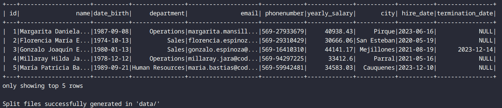

---

## 👩‍💻 Script 2: insert.py — Insert data into postgres

### 🔧 Install libraries that we are going to need:

| Library       | Description                                                | Installation Command          |
|---------------|------------------------------------------------------------|-------------------------------|
| pandas        | For working with CSVs and DataFrames.                      | `pip install pandas`          |
| sqlalchemy    | Python SQL toolkit and ORM.                                | `pip install sqlalchemy`      |
| psycopg2      | PostgreSQL driver required by SQLAlchemy.                  | `pip install psycopg2-binary` |
| python-dotenv | helps you load environment variables from `.env` file.     | `pip install python-dotenv`   |
| glob	        | Standard library for file pattern matching.                |  (built-in)                   |
| os	        | For cross-platform file handling and directory management. |  (built-in)                   |

### 📖 Explanation of the Code:

- This script:

    - Finds all CSV files in the ./data/ folder using glob.

    - Reads and combines all the CSVs into a single pandas DataFrame.

    - Creates a connection to a PostgreSQL database using SQLAlchemy.

    - Uploads the combined data to the employees table in the database.

### ✅ Example Output:

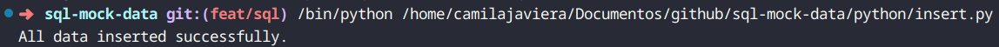
---

## 👩‍💻 Script 3: analysis.py — First analysis of the data

### 🔧 Install libraries that we are going to need:

| Library            | Description                                           | Installation Command     |
|--------------------|-------------------------------------------------------|--------------------------|
| PySpark            | Apache Spark Python API (for big data).               | `pip install pyspark`    |
| matplotlib.pyplot  | To create visualizations (histograms and bar charts). | `pip install matplotlib` |
| logging            | To track execution flow and info messages.            | (built-in)               |

### 📖 Explanation of the Code:

- This script:

    - Reads multiple CSV files using PySpark and combines them into a single DataFrame.

    - Calculates the age of each employee based on their date of birth and shows basic statistics.

    - Generates age distribution plots using matplotlib (histogram + bar chart with labels).

    - Performs department and city analysis, including counts and turnover (employees who left).

    - Logs activity and minimizes Spark output verbosity for clarity.

### ✅ Example Output:

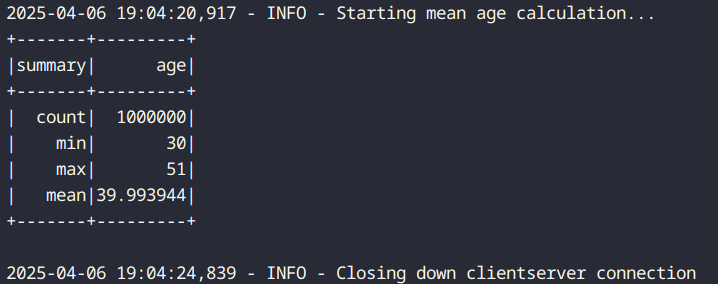

<br>

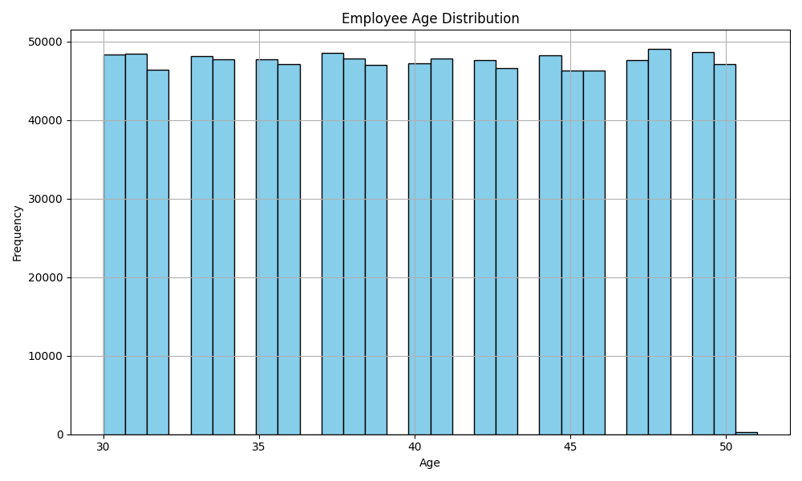

<br>

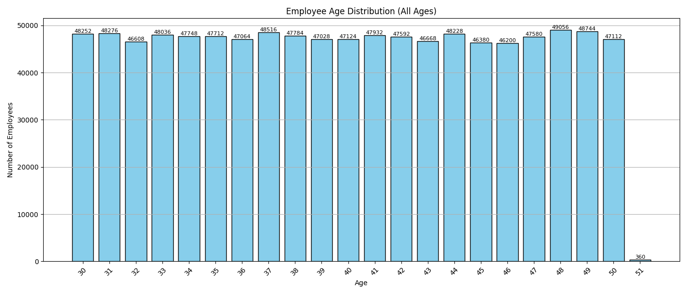

<br>

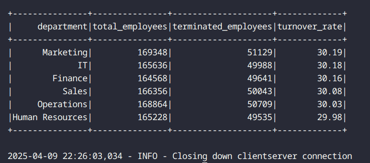

<br>

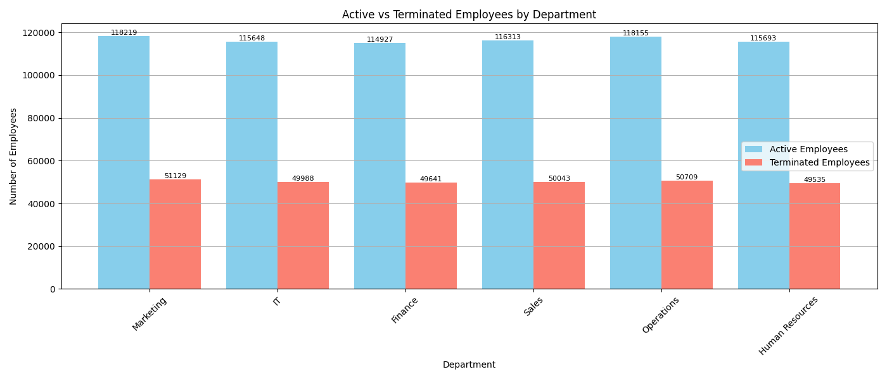

---

## 👩‍💻 Script 4: queries.py — Create SQL queries

### 🔧 Install libraries that we are going to need:

| Library    | Description                                     | Installation Command             |
|------------|-------------------------------------------------|----------------------------------|
| psycopg2   | PostgreSQL driver required by SQLAlchemy.       | `pip install psycopg2-binary`    |
| pandas     | For working with CSVs and DataFrames.           | `pip install pandas`             |
| connection | Custom local module to establish DB connection. | Make sure `connection.py` exists |
| locale     | Built-in module for localization/formatting.    | (built-in)                       |
| sys        | Built-in module to modify the system path.      | (built-in)                       |

### 📖 Explanation of the Code:

- This script:

    - Uses a custom connection() function to establish a PostgreSQL connection.

    - Tries to set locale to Spanish (es_ES.UTF-8) for formatting purposes.

    - Runs SQL queries using run_query(), returning results as a pandas DataFrame.

    - Includes 6 analysis (more to add) functions by city, department, and age, calculating turnover rates and salaries for active employees.

    - Executes all analyses and prints them when the script is run directly.

### ✅ Example Output:

- **by_city()**

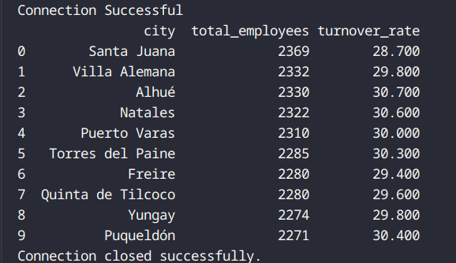

- **by_department()**

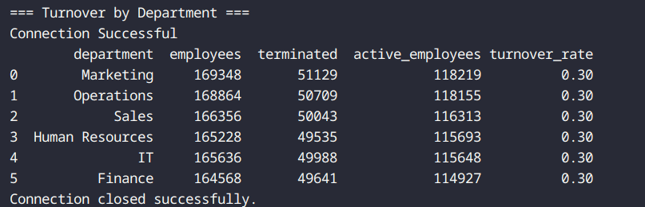

- **by_age()**

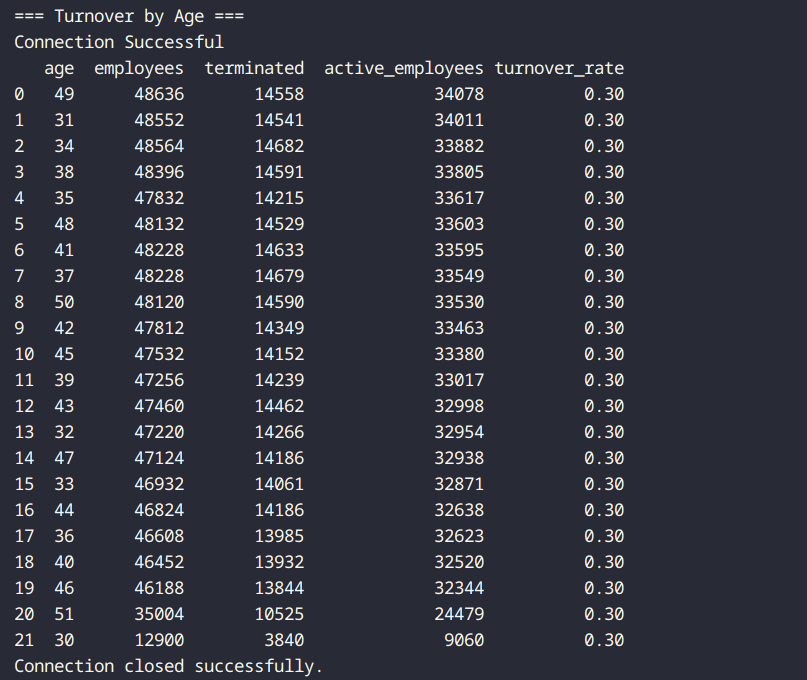

- **salary_by_city()**

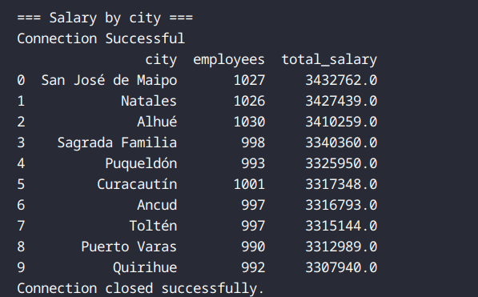

- **salary_by_department()**

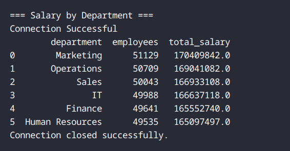

- **salary_by_age()**

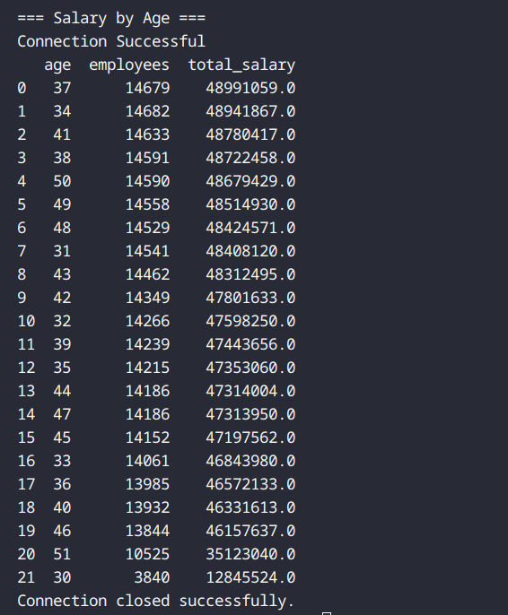

- **hired_and_terminated()**

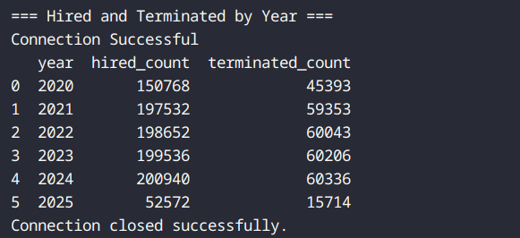

- **hired_and_terminated_department()**

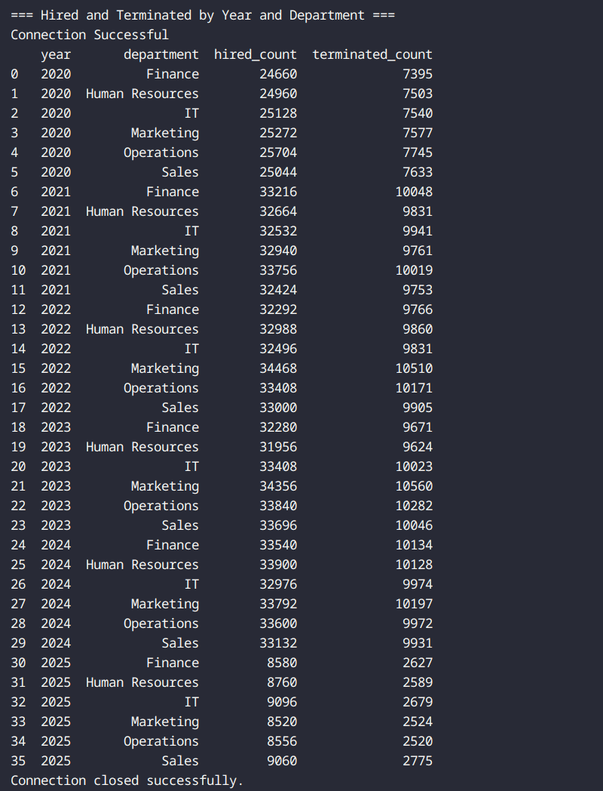

---

## 👩‍💻 Script 5: show_results.py — Plot SQL queries

### 🔧 Install libraries that we are going to need:

| Library           | Description                                           | Installation Command          |
|-------------------|-------------------------------------------------------|-------------------------------|
| matplotlib.pyplot | To create visualizations (histograms and bar charts). | `pip install matplotlib`      |
| seaborn           | For making nice statistical plots easily.             | `pip install seaborn`         |
| queries           | Custom local module to establish DB connection.       | Make sure `queries.py` exists |

### 📖 Explanation of the Code:

- This script:

    - Imports data from predefined SQL queries (like by_city, by_age, etc.) using custom functions.

    - Creates charts with Seaborn and Matplotlib to visualize employee data.

    - Plots bar charts for active employees and salaries by city and department.

    - Plots a line chart showing turnover rate by age, with value labels.

    - Plots a line chart showing yearly hires and terminations, including count labels.

### ✅ Example Output:

- **plot_by_city()**

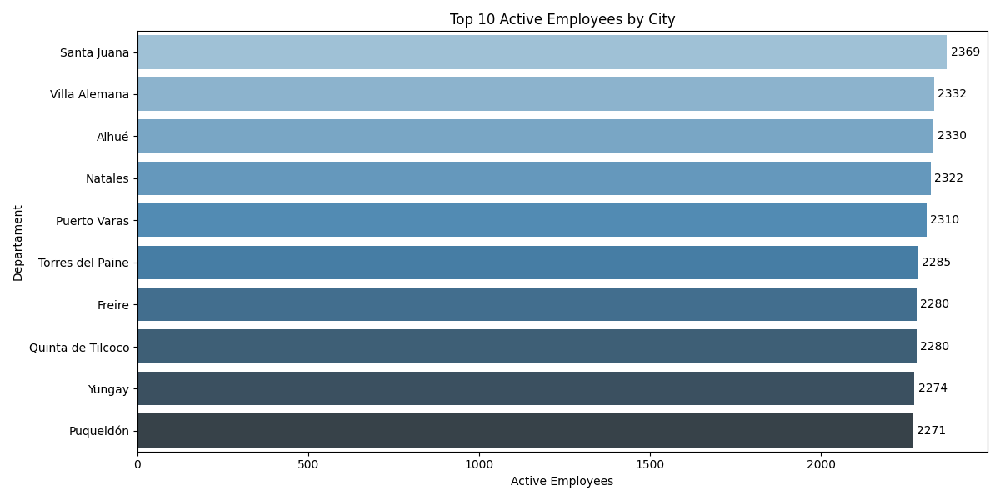

- **plot_by_department()**

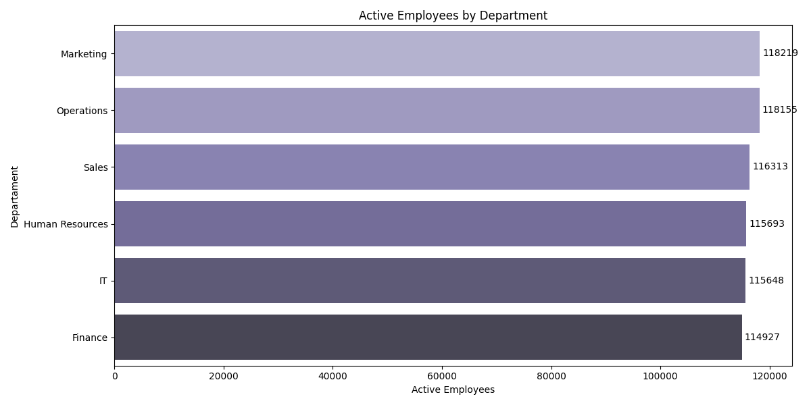

- **plot_by_age()**

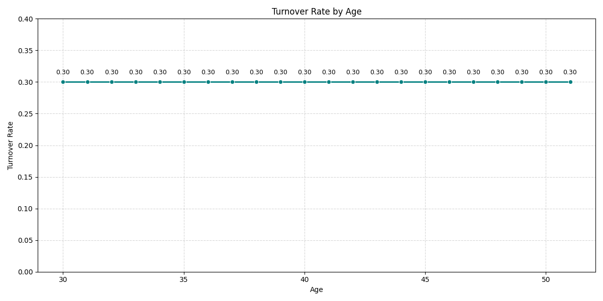

- **plot_salary_by_city()**

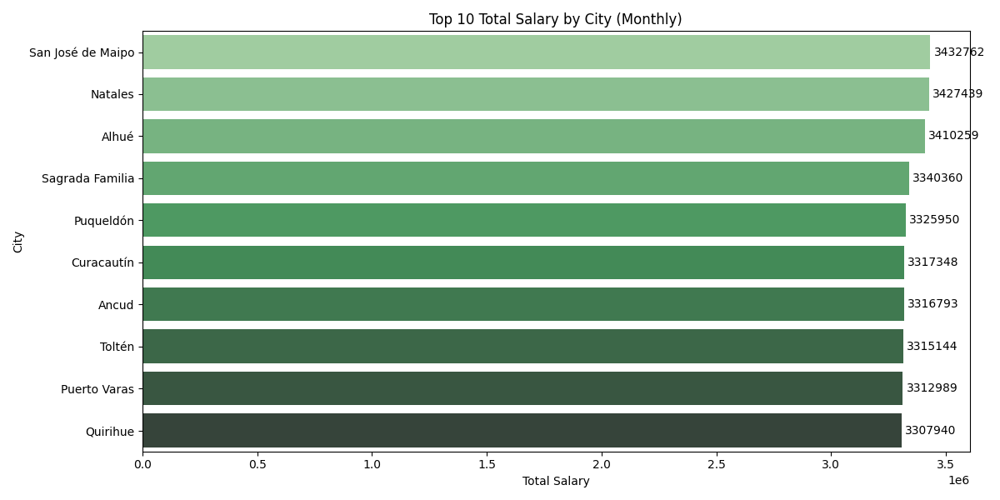

- **plot_salary_by_department()**

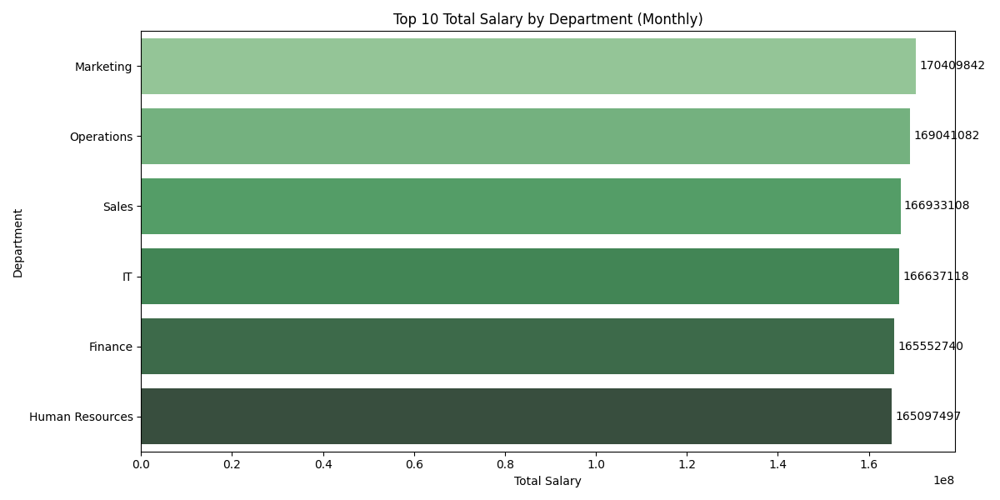

- **plot_hired_and_terminated()**

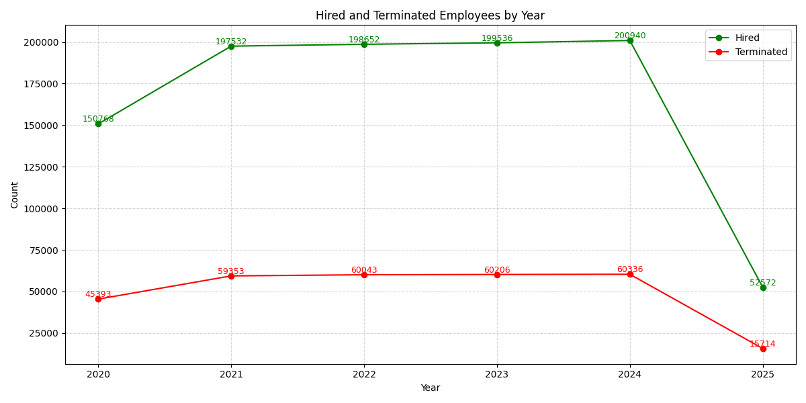

---